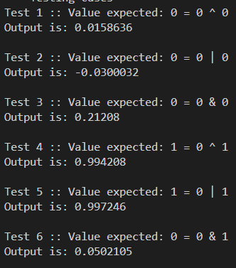
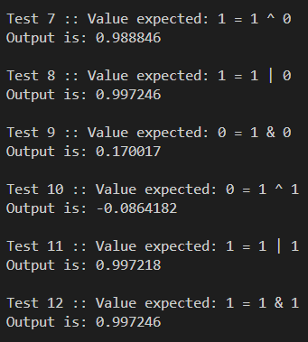
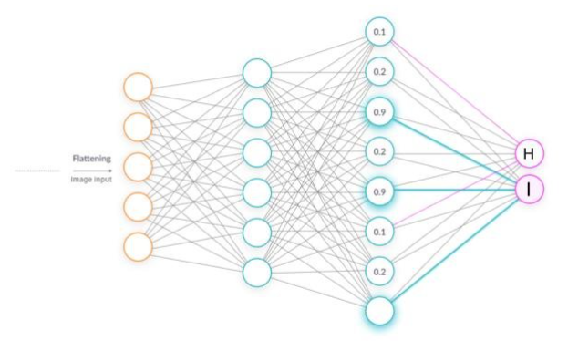
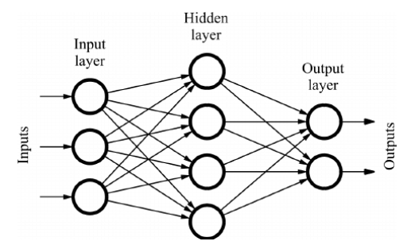
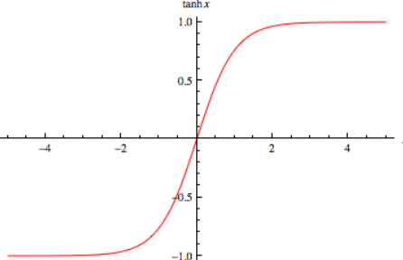

# NeuralNetwork
Neural Network that is developed in plain C++ to be able to represent a black-box model of a logic gate given to it by training it.

## MISS knowledge
Thanking the MISS class from College (Modeling and simulation of systems), we have understood how a Neural Network works. Here that knowledge, alongside OOP concepts is used to showcase a prototype of a black-box model of a neural network.

## What does it do?
The program is designated to use inputs (`std::vector` of inputs). Inputs used here are a 3d vector, a matrix, of `std::vector`(s). The inputs are stored and sent to the neural network, where they are processed. The output is a vector of results.

## Table of operations
| A 	| B 	| A ^ B 	| A \| B 	| A & B 	|
|:---:	|:---:	|:---:	|:---:	|:---:	|
| 0 	| 0 	| 0 	| 0 	| 0 	|
| 0 	| 1 	| 1 	| 1 	| 0 	|
| 1 	| 0 	| 1 	| 1 	| 0 	|
| 1 	| 1 	| 0 	| 1 	| 1 	|

## Examples
 

## More in-depth knowledge of Neural Network used
The neural network used is a `fully-connected`, `feed-forward` neural network. All nodes (neurons) are connected with every neuron in the next (previous) layer.

The method used for sending data is a `feed-forward` method. Feedforward is the reverse exercise of feedback. It's the process of replacing positive or negative feedback with future-oriented solutions. In simple terms, it means focusing on the future instead of the past.

The method used for training the neural network, is `data-propagation` method.
Backpropagation, or backward propagation of errors, is an algorithm that is designed to test for errors working back from output nodes to input nodes.

## Activator (transfer) function
Transfer function used for this neural network is `f(x) = tanh(x)`. The derivative is `f'(x) = 1 - tanh^2(x)` which can be approximated to `g(x) = 1 - x^2` for these values.

## Usage
<code>git clone https://github.com/NenadGvozdenac/NeuralNetwork</code>

<code>$ g++ NeuralNetwork/Application/main.cpp -o NeuralNetwork/Application/Program</code>

<code>$ ./NeuralNetwork/Application/Program.exe</code>

You can add an additional parameter after the `.exe`, indicating a number of tests. For example: <code>$ ./NeuralNetwork/Application/Program.exe 20000</code>.

## Credits
[Abhishek Pandey](https://www.youtube.com/@abhishekpandey4427) - tutorial for Neural network